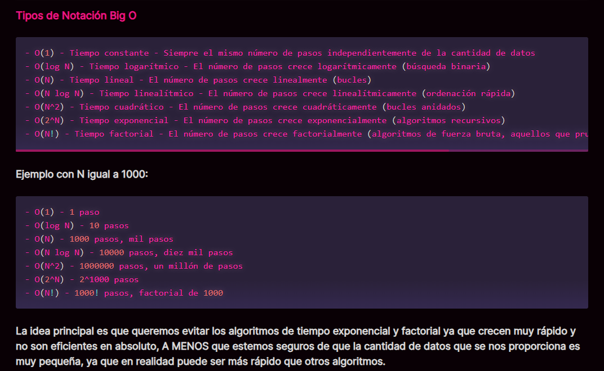

# Data Structures and Algorithms

  

  

[types-of-big-o-notation](https://gentleman-programming-book.netlify.app/es/book/Chapter06_Algorithms#types-of-big-o-notation)

## Implementation of Data Strucutures and Algorithms with Golang

### Data Strucutures

### Algorithms

### Coding Interview
