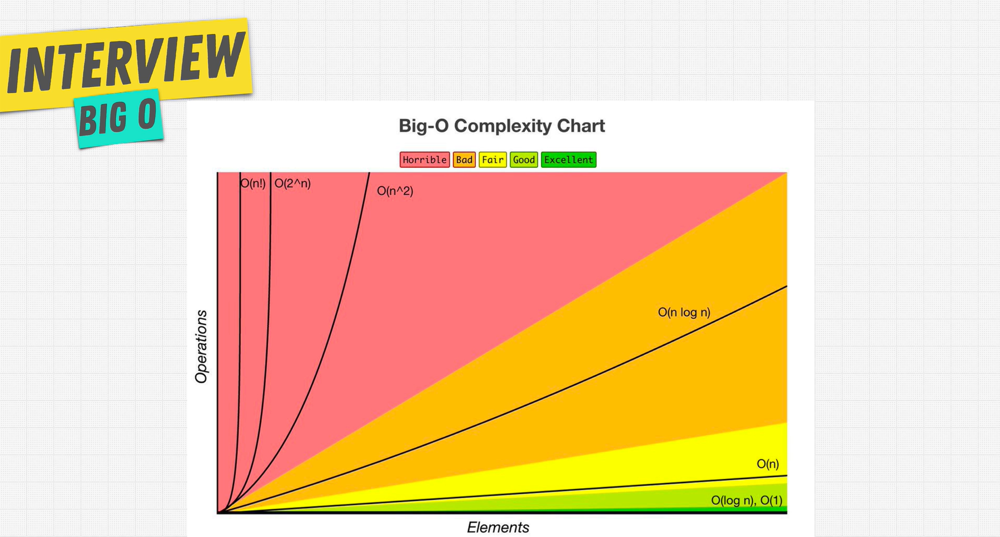

# Data Structures and Algorithms

  

## Implementation of Data Strucutures and Algorithms with Golang

### Data Strucutures

- Stack
  - Array implementation
  - LinkedList implementation
- Queue
  - Array implementation
  - LinkedList implementation
- LinkedList
- BST(Binary Search Tree)
- AVL Tree
- Graph (Undirected Unweighted Graph) _Adjacency list implementation_

### Algorithms

- Recursion
- Search
  - Linear Search
  - Binary Search
  - BFS (Breadth-first search)
  - DFS _Implemented in BST_
    | Pre-order | In-order | Post-order |
- Sort
  - Bubble Sort
  - Selection Sort
  - Insertion Sort
  - Merge Sort
  - Quick Sort
