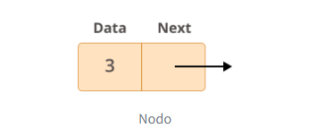

# LinkedList

## Comprensión de las listas enlazadas

Las listas enlazadas son una colección ordenada de objetos. ¿Qué las diferencia de las listas normales? Las listas enlazadas se diferencian de las listas en la forma en que almacenan elementos en la memoria. Mientras que las listas utilizan un bloque de memoria contiguo para almacenar referencias a sus datos, las listas enlazadas almacenan referencias como parte de sus propios elementos

Las **listas enlazadas** y las **listas (o arrays)** son estructuras de datos que se utilizan para almacenar colecciones de elementos, pero tienen diferencias fundamentales en la forma en que almacenan y acceden a estos elementos.

1. **Almacenamiento de elementos**:

   - **Listas (o arrays)**: En una lista, los elementos se almacenan en bloques de memoria contiguos. Esto significa que si tienes una lista de 5 elementos, estos se almacenarán uno al lado del otro en la memoria.

   - **Listas enlazadas**: En una lista enlazada, cada elemento se almacena en su propio bloque de memoria, llamado nodo. Cada nodo contiene el elemento y una referencia (o enlace) al siguiente nodo en la lista. Esto significa que los elementos de una lista enlazada pueden estar dispersos por toda la memoria, en lugar de estar en un bloque contiguo.

2. **Acceso a los elementos**:

   - **Listas (o arrays)**: Debido a que los elementos de una lista están en bloques de memoria contiguos, puedes acceder a cualquier elemento de la lista directamente si conoces su índice. Esto se llama acceso aleatorio y es muy rápido.

   - **Listas enlazadas**: En una lista enlazada, para acceder a un elemento específico, debes empezar desde el primer nodo y seguir las referencias de un nodo a otro hasta llegar al elemento que buscas. Esto se llama acceso secuencial.

Estas diferencias hacen que las listas enlazadas y las listas sean adecuadas para diferentes tipos de tareas. Por ejemplo, las listas enlazadas son ideales cuando necesitas agregar o eliminar elementos con frecuencia, ya que estas operaciones son muy eficientes. Por otro lado, las listas son excelentes cuando necesitas acceder a elementos en posiciones arbitrarias con frecuencia, ya que el acceso aleatorio es muy rápido.

**Conceptos principales**

Antes de profundizar más en qué son las listas enlazadas y cómo se pueden utilizar, primero conviene aprender cómo están estructuradas. Cada elemento de una lista enlazada se denomina nodo y cada nodo tiene dos campos diferentes:

- **data**: contienen el valor que se almacenará en el nodo.

- **next** contiene una referencia al siguiente nodo de la lista.

  

